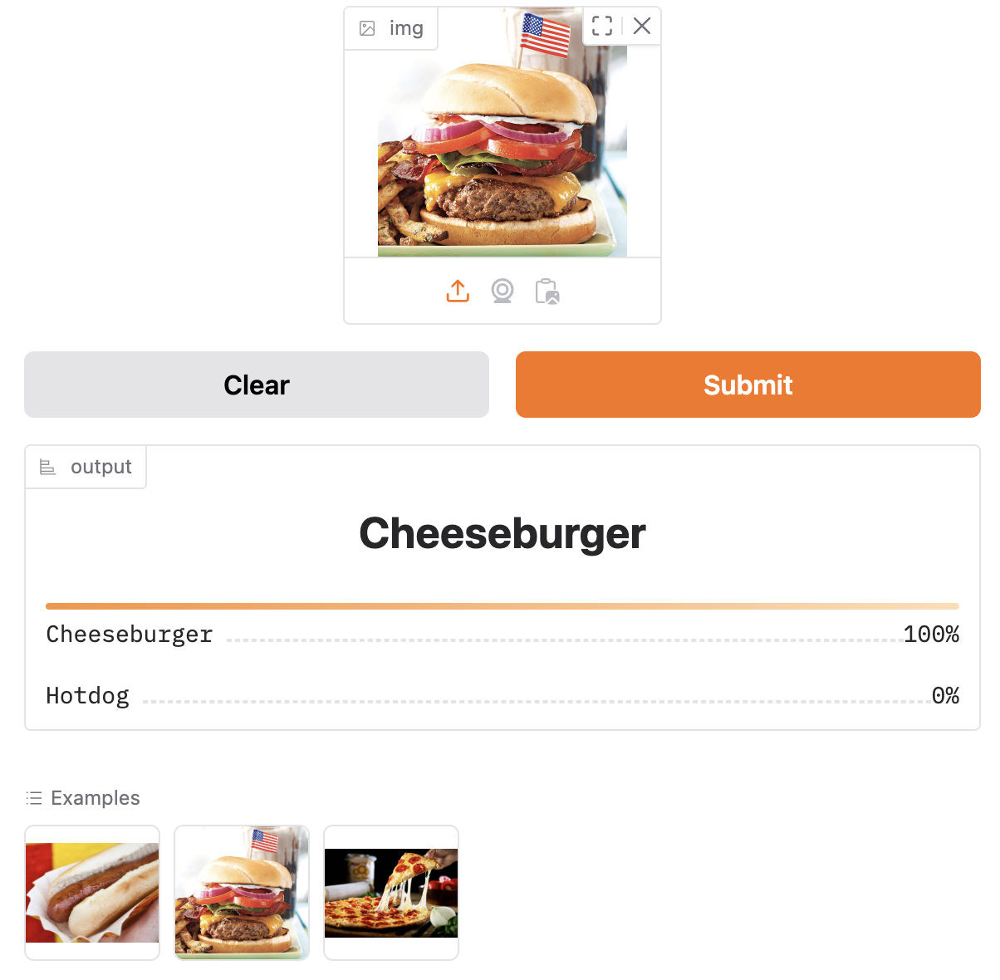

# Hotdog or Cheeseburger

Image classifier to determine if an image is a hotdog or cheeseburger.




## About

This project is essentially following the instructions in [Lesson 2 of Practical Deep Learning for Coders](https://course.fast.ai/Lessons/lesson2.html), and part of an effort to teach myself machine learning. It's "hello world" level machine learning, and I'm hoping to build on it further.

I ran this on an M4 Mac Mini, and results may vary if you run without a GPU available to pytorch.

## Setup

```
python3 -m venv venv
source venv/bin/activate
pip install -r requirements.txt
```

## Generate images

First step is collect images which will be used to train the image classifier. The fastai library includes a function to search for images via DuckDuckGo, and then write them to a folder that matches the query (i.e. "hotdog" query results get written to hotdog/). The name of the folder is then used as the label for the images in that folder:

```
python ./generate_images.py
```

After this step you should see `hotdog/` and `cheeseburger/` folders with ~150 images in each.

## Train image classifier

To train the image classifier, we grab the dataloader from `dataset.py`, and provide that to the vision learner. The fine\_tune step provides the number of epochs to train the data. The model is saved to `models/model.pth`

```
python ./train.py
```
> NOTE: On macOS I needed to include `PYTORCH_ENABLE_MPS_FALLBACK=1` before the command.

After it completes it will show some of the images with the labels, you can Ctrl+C to exit the program.

## Clean data

You can examine which images result in errors by running:

```
python ./clean_data.py models/model.pth
```
> NOTE: On macOS I needed to include `PYTORCH_ENABLE_MPS_FALLBACK=1` before the command.

The program will show the top 5 images that are incorrect based on the predicted label, actual label, loss, and confidence interval. You can determine whether to delete invalid images, or move images to the correct folder if they're mislabeled.

After cleaning, model needs to be retrained.

## Predict

You can see the prediction results of the model by running:

```
python ./predict.py models/model.pth <path-to-image>
```

There are example images in `examples/` if you want to run the model without generating images above.

## User interface

You can run a local gradio website by running:

```
python ./app.py
```

It will output a URL to enter into your browser.

## HuggingFace Space

At time of writing, this model was live on the [Hotdog or Cheeseburger Hugging Face Space](https://huggingface.co/spaces/bthdonohue/hotdog_or_cheeseburger).
